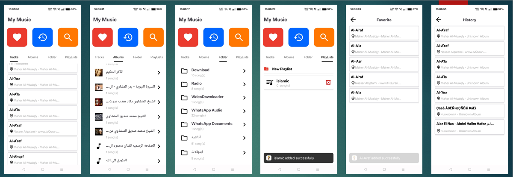
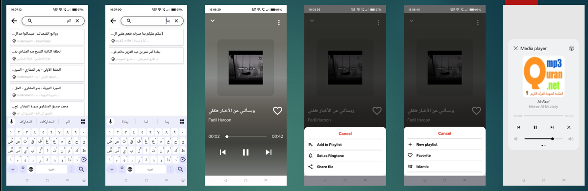

# Tunoo

## 🎵 Overview  
**Tunoo** is a sleek and modern music player app designed for smooth and enjoyable listening. Built with Kotlin, it offers powerful features with an intuitive interface, making music management effortless and fun.

---

## 🚀 Features & Tools  
- Media Player with seamless audio playback  
- Foreground Service to keep music playing in the background  
- Kotlin Coroutines for efficient asynchronous operations  
- Room Database for offline data persistence  
- Koin for lightweight dependency injection  
- View Binding for safer UI code  
- Shimmer Effect for smooth loading animations  

---

## 🔄 App Flow

- **Home Screen:** Central hub with access to all music categories.  
- **Playlists / Folders / Albums / History / Favorites:** Multiple ways to explore your music library.  
- **All Tracks:** Displays all songs from the chosen category.  
- **Audio Player:** Full control over your music playback.  

---

## 📸 Screenshots
  
  

---

## 📦 Installation & Setup  
1. Clone this repository.  
2. Open the project in Android Studio.  
3. Build and run the app on your device or emulator.  

---

## 📬 Contact

For any inquiries, feel free to connect with me on:

- **LinkedIn:** [www.linkedin.com/in/ali-kotb-497a4718a](https://www.linkedin.com/in/ali-kotb-497a4718a)  
- **Email:** alikotb38@gmail.com

---

## 📄 License  
This project is open-source and available for personal and educational use.
